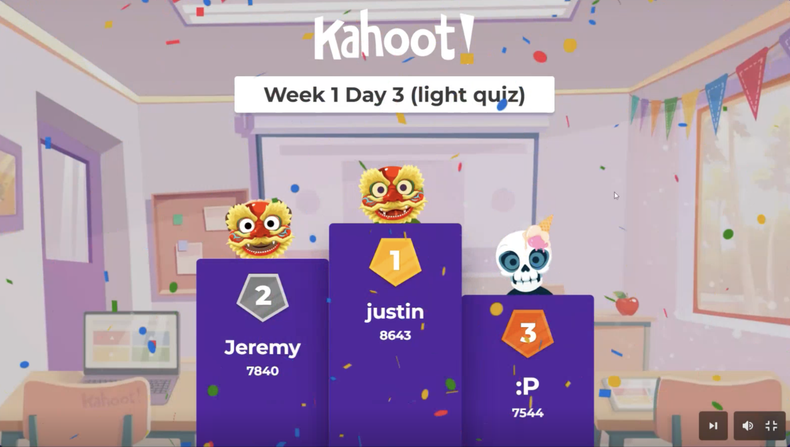

### Week 1 Reflection
Week 1 Reflection

Wrapped up the first week of the Diploma, starting from pure HTML/CSS structure and getting used to the front-end mindset.

It’s been a big shift from my usual Security+ focus, but it’s cool seeing how logic and structure carry over between fields. Even basic things like nesting, flow, and specificity feel a bit like managing network layers, just visual instead of packets.

Had a fun Kahoot session too, ended up taking first place 😅. Turns out all those Security+ recall drills actually helped with reaction speed and pattern recognition.

Overall, a solid start. Flexbox finally clicked, my Git commits are consistent, and I’m starting to enjoy front-end more than I expected.

*Cheeky little win on the class kahoot* 😆

