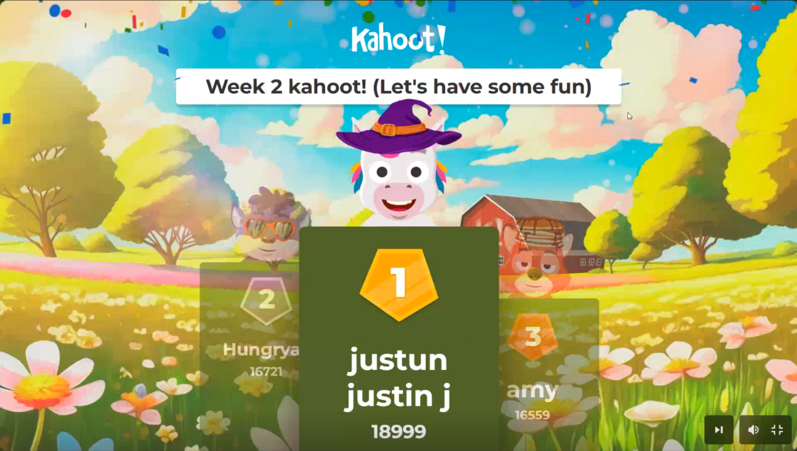

### Week 1 Reflection
Week 1 Reflection

Wrapped up the first week of the Diploma, starting from pure HTML/CSS structure and getting used to the front-end mindset.

It’s been a big shift from my usual Security+ focus, but it’s cool seeing how logic and structure carry over between fields. Even basic things like nesting, flow, and specificity feel a bit like managing network layers, just visual instead of packets.

Had a fun Kahoot session too, ended up taking first place 😅. Turns out all those Security+ recall drills actually helped with reaction speed and pattern recognition.

Overall, a solid start. Flexbox finally clicked, my Git commits are consistent, and I’m starting to enjoy front-end more than I expected.

*Cheeky little win on the class kahoot* 😆

## Week 2 Reflection

This week I went deeper into JavaScript, working through data types, strings, and basic logic. It’s interesting seeing how small syntax changes can affect behavior, especially when comparing coercion and equality in JavaScript and Python.

The coding labs helped me build muscle memory for writing and testing code faster. I’m also getting more comfortable using GitHub, organizing folders, and keeping my commits clear and consistent.

I won another class Kahoot which makes two weeks in a row. The quick-fire recall feels a lot like live debugging practice where focus and timing really matter.

Overall, week 2 felt more structured. My workflow in VS Code and DevTools is smoother, I understand how strings and variables connect, and I’m starting to think more like a programmer instead of just a learner.

