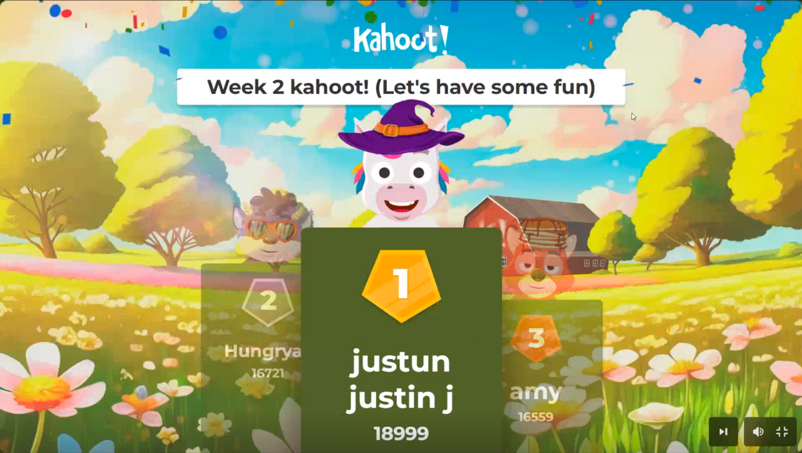

# Mission Ready Diploma Repo

This repo tracks my work for the Mission Ready Diploma in Digital Tech Development and Design.  
Each week has its own folder with projects, notes, and a short reflection on what I learned.  
It’s a mix of coding practice, experiments, and small wins along the way.

---

## About the Diploma

The course focuses on front-end and full stack development.  
We started with HTML and CSS and are now getting into JavaScript.  
There are live sessions, group work, and weekly projects that make it feel hands-on and practical.

---

## My Focus

I joined the diploma to get better at development and connect it with my long-term goal of working in cloud and AI security.  
So far I’ve been focusing on:
- Writing clean and readable HTML and CSS  
- Getting faster at using Git and GitHub  
- Understanding how JavaScript logic works  
- Learning how to explain projects clearly during presentations  

---

## Weekly Progress

### [Week 1 - HTML and CSS Basics](./week1/README.md)
- Learned how HTML gives structure and CSS controls style  
- Practiced Flexbox and built the Facebook Pay mock site  
- Completed layout challenges and improved my GitHub workflow  
- Ended the week with a Kahoot win  

### [Week 2 - JavaScript and Logic](./week2/README.md)
- Learned about variables, strings, numbers, and booleans  
- Compared JavaScript logic to Python and tested code in the console  
- Presented my Mission 1 ransomware-themed site to the class  
- Won another Kahoot and felt more confident with JavaScript

### [Week 3 - Conditionals, Loops, and Functions](./week3/README.md)
- Learned how conditionals (`if`, `else if`, `else`, and ternary) control logic flow  
- Practiced writing nested conditions and using operators to test multiple cases  
- Explored `for` and `while` loops to repeat actions and work with arrays  
- Started combining loops with arrays and objects for practical tasks  
- Built simple functions with parameters, return values, and default arguments  
- Felt a big jump in confidence writing and debugging JavaScript logic  

---

## Project Highlights

**Mission 1 - Ransomware Simulation Page**  
An HTML and CSS project built with a cybersecurity theme.  
I used animations, red and black colors, and layout effects to make it look like a fake ransomware warning.  
[View the live site](https://lolipop316.github.io/ransomware-simulation-ui/)

  

**Kahoot Wins - Week 1 and Week 2**  

  
  

---

## What’s Next

Next up I plan on adding:
- JavaScript loops, functions, and DOM work  
- More responsive layouts  
- Team projects and collaboration  
- Keeping GitHub tidy and updated every week  

---

## Tools I Use

- Visual Studio Code  
- Git and GitHub  
- Firefox Developer Edition  
- Draw.io for diagrams  

---

### Quick Reflection

The first three weeks have gone better than I expected.  
HTML and CSS started to feel natural after a few layout projects, especially once Flexbox clicked.  
JavaScript has been both challenging and rewarding — learning conditionals, loops, and functions made the logic side of coding more enjoyable.  
Even with the laptop issues during Week 3, I stayed consistent with the live classes and came out with a better understanding of how my system works.  
Each week feels like measurable progress, and I’m starting to genuinely enjoy solving problems with code.

