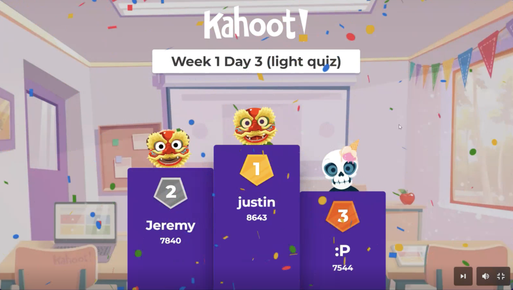

### Week 1 Reflection
Progressing with the first week of the Diploma with solid progress in HTML/CSS structure and a fun Kahoot surprise.  
Turns out my Security+ recall drills helped me react faster during the quiz - ended up taking first place.  
A good reminder that pattern recognition and focus training transfer across domains more than you’d expect.  

---