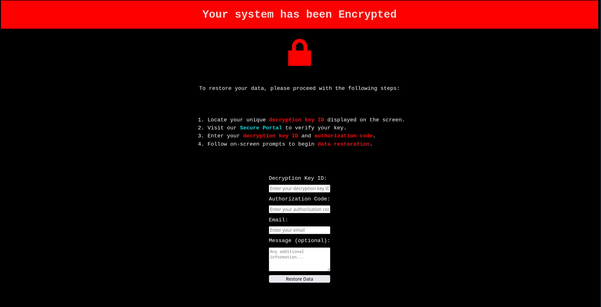

# Mission Ready Diploma Portfolio

This repository documents my learning journey through the Mission Ready Diploma in Digital Technology Development and Design.  
Each week builds on the last, combining hands-on projects, coding practice, and personal reflections to show my progress as a developer.

---

## About the Diploma

The Mission Ready Diploma focuses on full stack web development.  
It covers HTML, CSS, JavaScript, Git, and teamwork projects that prepare students for technical roles in the industry.  
The learning is project-based, with weekly challenges and presentations to apply new skills in real time.

---

## My Focus

I joined the program to strengthen my front-end development skills and connect them to my long-term goal of working in cloud and AI security.  
So far, I’ve been building a base in:
- Writing clean HTML and CSS  
- Using Git and GitHub to manage code  
- Learning JavaScript for logic and interactivity  
- Presenting and explaining technical work clearly  

---

## Weekly Progress

### [Week 1 – HTML and CSS Foundations](./week1/README.md)
- Learned how HTML gives structure and CSS controls presentation  
- Practiced Flexbox for layout and responsive design  
- Created the Facebook Pay mock site and personal project layouts  
- Won the class Kahoot and finished the week feeling more confident with web basics  

### [Week 2 – JavaScript Fundamentals](./week2/README.md)
- Learned about data types, strings, numbers, and booleans  
- Practiced logical thinking and tested JavaScript code in the console  
- Presented the Mission 1 ransomware-style page built with HTML and CSS  
- Won another Kahoot and improved my workflow in VS Code and GitHub  

---

## Project Highlights

**Mission 1 – Ransomware Simulation Page**  
A creative HTML and CSS project designed with a cybersecurity theme.  
Used animation, color, and layout to create a tense "system error" look and feel.  
[View Project](https://github.com/lolipop316/ransomware-simulation-ui)

  

**Kahoot Wins – Week 1 and Week 2**  

  
  

---

## Next Steps

- Learn functions, loops, and DOM interaction in JavaScript  
- Improve responsive layouts with media queries  
- Start building interactive front-end projects  
- Keep documenting progress each week in GitHub  

---

## Tools Used

- Fedora Linux (i3)
- Visual Studio Code  
- Git and GitHub  
- Firefox Developer Edition  
- Draw.io for diagrams  

---

## Reflection Summary

The first two weeks have built a strong foundation in both coding and workflow habits.  
I’ve learned to plan, test, and reflect on my work while staying consistent with commits and documentation.  
Each week is building more confidence to explain my projects and think like a developer.
