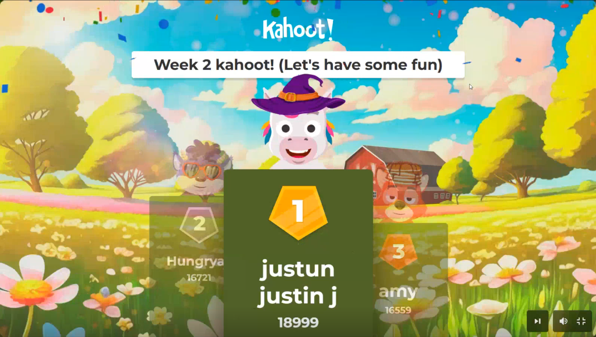

# Week 2 Overview

This week focused on getting deeper into JavaScript.  
We covered data types, strings, numbers, booleans, and how logic works behind the scenes.  
It felt like a big step up from HTML and CSS, but once the syntax started to make sense, it got more fun to experiment in the console.

---

### Folder Breakdown
- **day1-rwd:** Responsive Web Design review and setup  
- **day2-git:** Git refresher, commits, and pushing to GitHub  
- **day3-js-intro:** JavaScript basics and writing first scripts  
- **day4-presentation-mission1:** Mission 1 project presentation day  
- **day5-number-and-boolean:** Learning about numbers, booleans, and logic  
- **day5-string:** Working with strings, concatenation, and template literals  

---

### Reflection
This week felt smoother since the workflow in VS Code and GitHub started feeling natural.  
Writing JavaScript and testing small pieces of code helped everything click faster.  
Winning Kahoot again was a fun bonus, two weeks in a row now.  
By the end of the week, I was starting to think like a programmer, not just someone following tutorials.

  

---

### Presentation
The Mission 1 presentation went well.  
I built a fake ransomware-style page using HTML and CSS, which got a few laughs and some positive feedback.  
It was nerve-wracking at first, but once I started explaining the design choices, it became easier to talk.  
It felt good to mix creativity with cybersecurity and stand out from the usual front-end projects.

  

---

### Next Steps
Next week’s focus will be diving deeper into JavaScript logic, conditionals, and DOM interaction.  
I also plan to keep improving the ransomware project by adding small animations and a timer.
